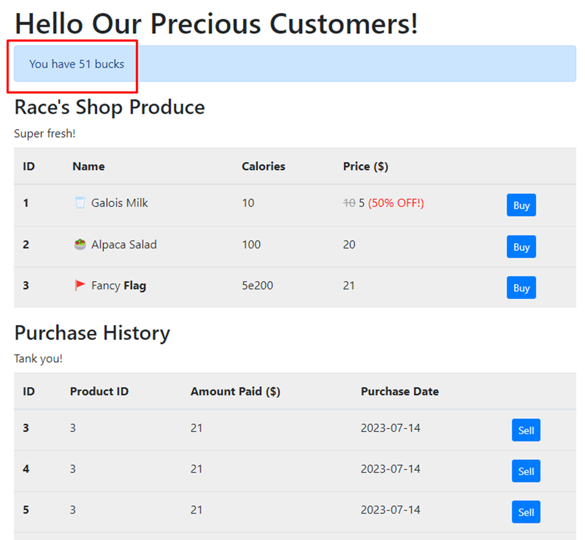

# RaceShop

Build & Jalankan :

```
> docker build . -t local/race_shop
> docker run --name race_shop -it --rm -p 1002:1002 local/race_shop
```

Aplikasi dapat diakses pada alamat [http://localhost:1002](http://localhost:1002). Masukkan sembarang user dan password untuk login. 

***Misi :***

> Belilah item "Fancy Flag". 
> 
> Masalahnya adalah, saldo uang yang dimiliki hanya 20 dolar, sedangkan harga "Fancy Flag" 21 dolar. 
> 
> Untuk keberhasilan misi ini, kita dapat memanfaatkan celah kerentanan race condition yang terdapat pada aplikasi.


Gunakan kode program yang tersedia untuk melakukan penyerangan :

```
> python attack.py
```

Setelah dilakukan penyerangan

